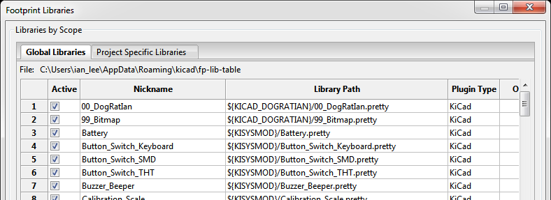

# KiCad library and related files

## Setup
1) Clone all files to your harddisk. For example "U:\\_lib\\kicad".

2) At KiCad menu bar, select "Preferences->Configure Paths".

3) Add a new variable, name is "KICAD_DOGRATIAN", Value is "U:\\_lib\\kicad".

4) Open Symbol Library Editor. At menu bar, select "Preferences->Manage Symbol Libraries".

5) Click the "Browse Libraries" button, then select the library file "00_DogRatIan.lib".

6) Open Footprint Library Editor. At menu bar, select "Preferences->Manage Symbol Libraries".

5) Click the "Browse Libraries" button, then select the library file "00_DogRatIan.pretty".

## 0.15mm Design Rule
"blank_0_15mm_Rule.kicad_pcb" is a blank 50x50mm PCB file, with a 0.15mm design rule.

- Trace width: 0.15mm

- Trace routing grid: 0.15mm (5.9mil)

- Clearance: 0.145mm (5.7mil)

- Suggested routing grid: 0.15mm

